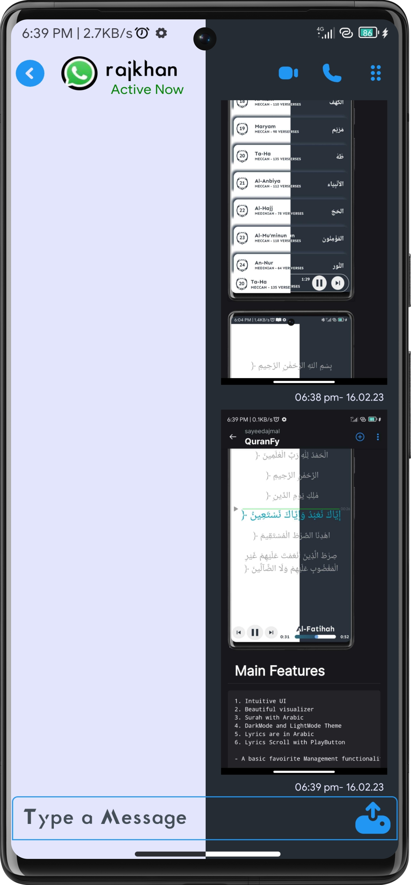

# ConnectX CHATING FOR ANDROID

<b>ConnectX for Android is a realtime chating app writtern in java using Firebase.

ConnectX allows to send and receive text messages, photos.</b>

# SCREENSHOTS

# FEATURES

Some features are binded.

    1. Simple UI Interface.
    2. Realtime Chating Function.
    3. Calling Feature (Developing Mode).
    4. Status (Active).
    5. No Last Seen.
    6. DarkMode and LightMode Available(Match to your Phone Mode).
    7. Chat Request (Developing Mode).
    9. Message Notification.
    10. Video Calling Feature (Developing Mode).

# API USED

        1. Firebase (Realtime Database)
        2. Glide (Image Fetch)
        3. CircleImageView (Round Image)
        4. Neumorphism (Noumorphism View)
        5. Volley (Notification)
        6. FCM (Firebase Console Messaging)
