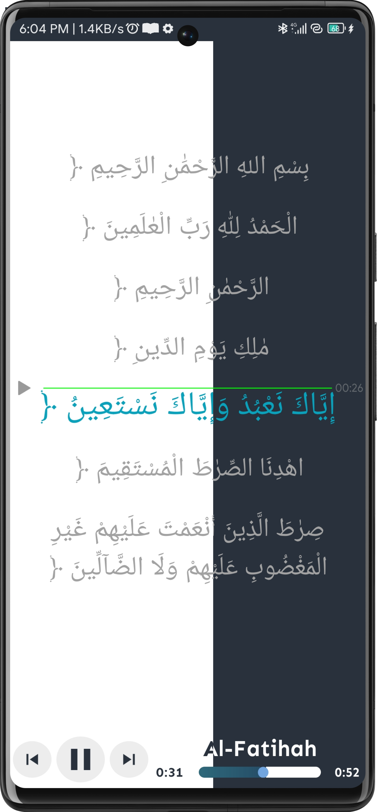

# QURANFY QURAN AUDIO PLAYER (Lyrics)

# About

<h1>This is the Source Code Repository of the QuranFy (Quran Audio Player). The main Focus of this Project is to Create an Quran Audio Listening Player that is Optimized by Audio with Soothing Voices of Reciting Quran and to keep the UI as Simple as Possible.

# Screenshots

# Main Features

    1. Intuitive UI
    2. Beautiful visualizer
    3. Surah with Arabic
    4. DarkMode and LightMode Theme
    5. Lyrics are in Arabic
    6. Lyrics Scroll with PlayButton 

    - A basic favoirite Management functionality is alos part of this Player. Uses Firebase Cloud Messaging to send Special Notification.

# DEVELOPING MODE

* Adding Lyric Files.
* Adding Functionalities.
* Adding LandScape Mode for Reading Quran.
* Adding Qirat in Another Tab.
* Fixing Color Contrast.

## OpenSource API Used

    - LyricsView
    - Neomorphism
    - Firebase 

# License

 GNU General Public License v3.0
